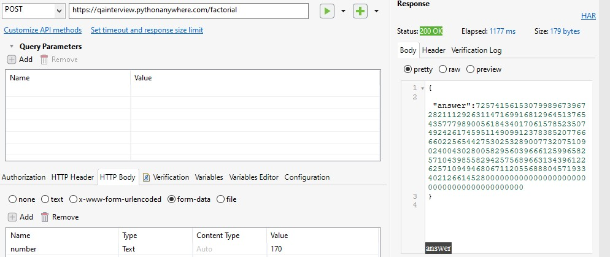
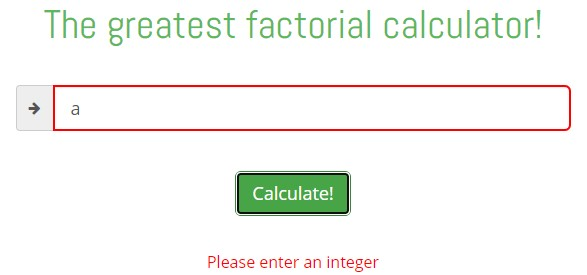
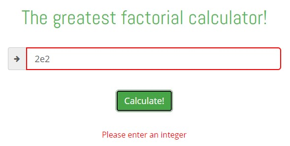
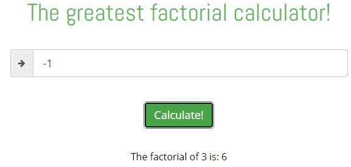
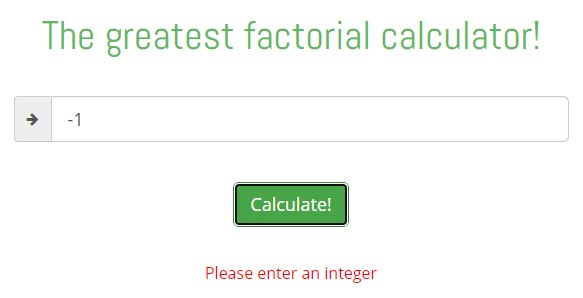

# Fintax QA Automation Internship Test Report

This repository contains automation testing code for a [factorial calculator](http://qainterview.pythonanywhere.com/) by using Katalon Studio.
The web application was tested by using Chrome 92.0.4515.159, Firefox 91.0.2, and Edge 92.0.902.84.

# Setup
1. Clone this repository

    `git clone https://github.com/hafizhmh/fintax-qa-test-intern-report.git`
2. Download [Katalon Studio](https://www.katalon.com/download/)
3. Open Katalon Studio
4. Open the tests folder (File>Open Project)
5. There are 5 items inside Test Cases:

   * General UI and Navigation
   * Positive integer input
   * Negative integer input
   * Big positive integer input
   * Series of valid-invalid input
6. Double click to open one of the files above and press Run on the toolbar (or press Ctrl + Shift + A on Windows). By default, it will open your default web browser but it can be changed by clicking the dropdown.
7. The results can be viewed on Log Viewer and Console tab at the bottom. In the Log Viewer, passed tests will have a green checkmark, failed tests will have a red cross mark, and failed optional tests will have a yellow triangle mark.

# Accessing the API directly
Requesting the calculation can also be done directly to the API by using the POST method to the `/factorial` path, carrying form-data with key `"number"` and an integer value.

# Acceptable values
### The application correctly calculate 0! and 1!

### Leading zero is still resulting the correct value

### Up to 21! will be displayed as is, without using scientific notation

### Up to 170! will be displayed correctly as a numerical value

# Correct Prompt
### Inserting a non numerical value will raise an error prompt

# Limitation
### From 171!, "infinity" is displayed as the result instead.

### 990! and above will raise HTTP Error 500

# Known Issue

### Title tag

The title has a typo: "Factoriall" instead of "Factorial".

### Copyright notice

According to the [Qxf2 Service web](https://qxf2.com/?utm_source=qa-interview&utm_medium=click&utm_campaign=From%20QA%20Interview) from the copyright link, the copyright message should be  "© Qxf2 Services 2013 - 2021".

### Wrong href value

The "Terms and Conditions" hyperlink links to the privacy document, while the "Privacy" hyperlink links to the Terms and Condition document.

### Wording

I believe the word "best" is more appropriate to use than "greatest".

### Enter key can not be used yet
Users need to press the "Calculate!" button to request the result. While it is indeed working, I believe enabling enter key usage will improve the web's user experience.

* Side note: Enter key automation from Katalon failed to be done properly on Firefox

### Inserting negative value will not raise an error prompt nor update the previous prompt

Step to reproduce:

1. Input a valid input, such as 3
2. The prompt "The factorial of 3 is: 6" will be shown
3. Input a negative value, such as -1
4. The prompt is still exactly the same as before

Another case:
1. Input an invalid input but not a negative integer, such as "-1a3"
2. The prompt "Please input an integer"
3. Input a negative value, such as -1
4. The prompt is still exactly the same as before

The above case can make users confused: The input is an integer but it apparently still raises an error.
